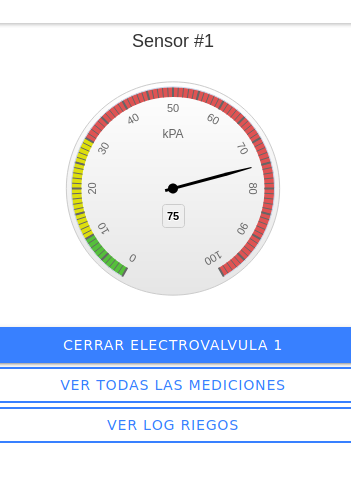

# TP de Diseño de Aplicaciones Multiplataforma
Autor: Martin N. Menendez.

# Introduccion
El proyecto consiste en un sistema de riego automatizado. Es el trabajo final de la asignatura "Desarrollo de Aplicaciones Multiplataforma" de la Especialización en Internet de las Cosas (CEIoT) de la Facultad de Ingeniería de la Universidad de Buenos Aires (FIUBA)

# Correr la aplicación sin docker-compose

## Base de datos

Se utilizo la "estructuraTPDAM.sql" como base y luego con "DAM.sql" se poblo la tabla de datos iniciales.

## Para levantar el back-end

Moverse hasta la carpeta Back_end/database para correr los scripts.
```sh
cd Back_end
cd database
./mysql.sh
./phpmyadmin.sh
```
Si ya se tiene un proceso de MySQL ocupando el puerto por defecto (3306) se debe dar de baja MySQL previamente con

```sh
 sudo systemctl stop mysql-server
```
o
```sh
sudo service mysql stop
```
Con ambos scripts funcionando volver a la carpeta Back_end y correr

```sh
node index.js
```

Y se debera ver el mensaje "Api funcionando".

## Para levantar el Front-End

Moverse hasta la carpeta Front_end y ejecutar

```sh
ionic serve -o
```

Lo cual abrira una pestaña del navegador en "http://localhost:8100/home" y se debera ver lo siguiente:


## Dispositivo





## Medicion


## Riego


# Contribuir
Para contribuir realizar un pull request con las sugerencias.

Al ser un proyecto autoconclusivo, solo con fines académicos, no tendrá mantenimiento futuro.
# Licencia
GLP
